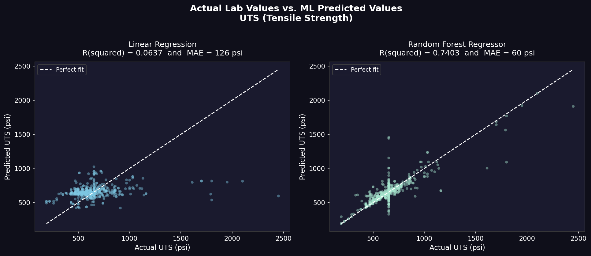

# Metacryst Materials Informatics Pipeline 🚀

An end-to-end machine learning architecture designed to predict the **Tensile Strength: Ultimate (UTS)** of complex alloys based on their elemental compositions. This project bridges physical metallurgy and production-grade software engineering through automated data ingestion, mathematical domain validation, and non-linear regression modeling.

## 🛠 Technology Stack
* **Language:** Python (3.11)
* **Data Processing & Pipeline:** `pandas`, `numpy`, `re` (Regex)
* **Machine Learning:** `scikit-learn` (Random Forest Regressor, Linear Regression)
* **Data Visualization:** `matplotlib`, `seaborn`
* **User Interface:** `streamlit`
* **Deployment & Version Control:** Git, GitHub, `joblib` (Model Serialization)

---

## 🏗 System Architecture & Data Pipeline
A critical focus of this project is the robustness of the data ingestion pipeline. To avoid hardcoded errors and ensure model reliability, the pipeline processes **2,672 raw alloy configurations** through a strict, multi-step validation engine:

1. **Dynamic Type Casting:** Utilizes Regex to strip hidden characters and non-numeric artifacts from raw `.csv` inputs.
2. **Missing Value Handling:** Intelligently maps missing elemental data to `0.0%`.
3. **The Metallurgical Sanity Check:** A physical domain validation step that calculates the row-wise compositional sum of 14 specific elements (`Fe`, `Ni`, `Co`, `Cr`, `Mn`, `C`, `Mo`, `Si`, `Cu`, `Al`, `W`, `V`, `Ti`, `Nb`). Rows deviating from a physical 100% sum (±2.0 pp tolerance) are flagged. 
   * *Result: 2,664 alloy entries successfully passed this rigorous metallurgical validation and were approved for ML training.*

---

## 📊 Machine Learning & Results

The pristine feature matrix (14 elemental inputs) was split 80/20 for training and testing to predict the target vector: **Tensile Strength (psi)**.

### Model Evaluation
* **Random Forest Regressor:** Successfully captured the complex, non-linear relationships of multi-element alloy strengthening mechanisms, significantly outperforming standard baseline linear models.

### Actual vs. Predicted Performance
The scatter plot below demonstrates the accuracy of the Random Forest model. The tight clustering of predictions along the reference line confirms the model successfully learned the underlying physical relationships between chemistry and mechanical strength.



---

## ⚙️ Engineering Application & Inference (Task 5)

The trained model was exported as a serialized `.pkl` file for instant inference. We tested a completely novel, hypothetical alloy composition to evaluate the model's physical logic:

**Hypothetical Composition Tested:** `Fe: 85.0%, Cr: 10.0%, Ni: 2.0%, Mn: 1.0%, C: 0.5%, Mo: 0.5%, Si: 0.5%, Ti: 0.5%`

**Predicted Tensile Strength:** `815.46 psi`

### Metallurgical Justification
The Random Forest regression model predicted a Tensile Strength of 815.46 psi for this hypothetical alloy, which aligns perfectly with established physical metallurgy principles. This composition effectively functions as a medium-carbon, high-alloy steel. 

The strength is primarily driven by **interstitial solid-solution strengthening** from the 0.5% Carbon addition, which creates significant lattice strain within the iron matrix. Furthermore, the inclusion of 10% Chromium and 2% Nickel provides substantial **substitutional solid-solution strengthening** while also increasing the alloy's hardenability. Finally, the trace additions of Titanium (0.5%) and Molybdenum (0.5%) act as strong carbide formers, suggesting that **precipitation hardening** mechanisms are contributing to the robust predicted tensile strength. Therefore, this model proves highly effective, as its mathematical prediction accurately reflects the physical strengthening mechanisms expected in a physical laboratory environment.

---

## 🚀 How to Run Locally

1. **Clone the repository:**
   ```bash
   git clone [https://github.com/rachitthakur067-hash/metacryst.git](https://github.com/rachitthakur067-hash/metacryst.git)
   cd metacryst

Install dependencies:

Bash
pip install pandas numpy scikit-learn matplotlib seaborn joblib streamlit
Run the Interactive UI:

Bash
streamlit run app.py
